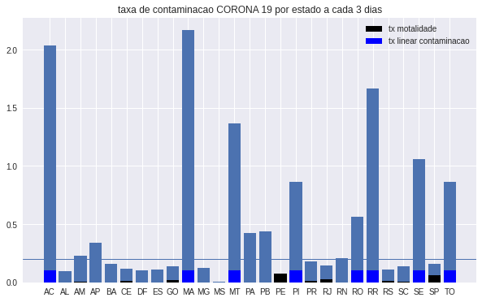
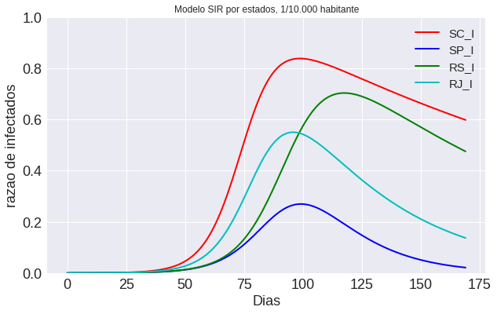

<!-- PROJECT SHIELDS -->
<!--
*** I'm using markdown "reference style" links for readability.
*** Reference links are enclosed in brackets [ ] instead of parentheses ( ).
*** See the bottom of this document for the declaration of the reference variables
*** for contributors-url, forks-url, etc. This is an optional, concise syntax you may use.
*** https://www.markdownguide.org/basic-syntax/#reference-style-links
-->
<!--
[![Contributors][contributors-shield]][contributors-url]
[![Forks][forks-shield]][forks-url]
[![Stargazers][stars-shield]][stars-url]
[![Issues][issues-shield]][issues-url]
[![MIT License][license-shield]][license-url]
[![LinkedIn][linkedin-shield]][linkedin-url]
-->


<!-- PROJECT LOGO -->
<br />
<p align="center">
  <a href="https://github.com/cmpaulo/corona">
    
  </a>

  <h3 align="center">CORONA COVID 19 BRAZIL</h3>

  <p align="center">
    An awesome analysis of CORONA COVID 19! MODELO PREDIÇÃO CORONA VÍRUS QUARENTENA PARA O ESTADO DE SÃO PAULO, BRASIL
    <br/>
    <a href="https://github.com/cmpaulo/corona"><strong>Explore the docs »</strong></a>
    <br/>
    <br/>
    ·
    <a href="https://github.com/cmpaulo/corona">Report Bug</a>
    ·
    <a href="https://github.com/cmpaulo/corona">Request Feature</a>
  </p>
</p>


<!-- TABLE OF CONTENTS -->
## Table of Contents

* [About the Project](#about-the-project)
* [Getting Started](#getting-started)
  * [Prerequisites](#prerequisites)
  * [Installation](#installation)
* [Usage](#usage)
* [Roadmap](#roadmap)
* [License](#license)
* [Contact](#contact)
* [Acknowledgements](#acknowledgements)


<!-- ABOUT THE PROJECT -->
## About The Project

[![Product Name Screen Shot][product-screenshot]](https://example.com)

Observing the worldwide tendency to ignore some diseases that can become a pandemic. the pandemic that is in fashion requiring some knowledge of its behavior for the prediction and estimation of cases from tables of data collected from the global health agencies. These routines are still very primary, but we can already observe some behavior that we can predict or estimate with models of evolution of the infection (I) of healthy individuals (S) that can kill (D) these or let these (R, E) live.
<!--
Here's why:
* Your time should be focused on creating something amazing. A project that solves a problem and helps others
* You shouldn't be doing the same tasks over and over like creating a README from scratch
* You should element DRY principles to the rest of your life :smile: Of course, no one template will serve all projects since your needs may be different. So I'll be adding more in the near future. You may also suggest changes by forking this repo and creating a pull request or opening an issue.A list of commonly used resources that I find helpful are listed in the acknowledgements.-->


<!-- GETTING STARTED -->
## Getting Started

This program has a database until March 24, 2020 for the number of confirmed cases for several countries. With the programs you can carry out an assessment of the mortality of this CORONA 19, and time evolution.

To get a local copy up and running follow these simple example steps.

### Prerequisites

The list of things that you need to use the software and how to install them.
* pip
```sh
pip install pandas numpy scipy wget
```

### Installation

1. Get a free API Key at [https://github.com/cmpaulo/corona](https://github.com/cmpaulo/corona)
2. Clone the repo
```sh
git clone https://github.com/cmpaulo/corona.git
```
<!--// 3. Install NPM packages
// ```sh
// npm install
// ```
// 4. Enter your API in `config.js`
// ```JS
// const API_KEY = 'ENTER YOUR API';
```
-->


<!-- USAGE EXAMPLES -->
## Usage

ABOUT TAXS IN BRASIL




ABOUT SIR MODEL


<!--
_For more examples, please refer to the [Documentation](https://example.com)_
-->


<!-- LICENSE -->
## License

Distributed under the MIT License. See `LICENSE` for more information.


<!-- CONTACT - email@example.com --->
## Contact

Your Name - [@cmp0484](https://twitter.com/cmp0484)

Project Link: [https://github.com/cmpaulo/corona](https://github.com/cmpaulo/corona)


<!-- ACKNOWLEDGEMENTS -->
## Acknowledgements
* [GitHub Pages](https://pages.github.com)

* [linkedin-url]: (https://www.linkedin.com/in/claudio-machado-paulo-1866a2146)

# CORONA COVID19 BRAZIL
MODELO Previsão corona19, covid19, covid 19,
MODELO PREDIÇÃO CORONA VÍRUS, QUARENTENA, ESTADO DE SÃO PAULO, BRASIL
MODELO SIR, MODELO SIRE,BRASIL 2019
