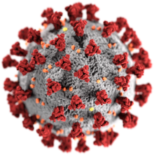

<!-- PROJECT SHIELDS -->
<!--
*** I'm using markdown "reference style" links for readability.
*** Reference links are enclosed in brackets [ ] instead of parentheses ( ).
*** See the bottom of this document for the declaration of the reference variables
*** for contributors-url, forks-url, etc. This is an optional, concise syntax you may use.
*** https://www.markdownguide.org/basic-syntax/#reference-style-links
# fatality_rate_southest.png
# fatality_rate_south.png
# Fatality_rate.png
-->

<!-- PROJECT LOGO -->
<br />
<p align="center">
  <a href="https://github.com/cmpaulo/corona">
    
  </a>

  <h3 align="center">Coronavirus (COVID-19) in Brazil</h3>

  <p align="center">
    An Analysis of the Spread of Coronavirus (COVID- 19) in Southeast Brazil<br/>
  using Prediction Model <br/> 
    <br/>
  <br/>
    · <a href="https://github.com/cmpaulo/corona"><strong>Explore the docs »</strong></a>
    · <a href="https://github.com/cmpaulo/corona">Report Bug</a>
    · <a href="https://cmpaulo.github.io/corona/"> GitPages - Site Corona </a>
    · <a href="https://github.com/cmpaulo/corona">Request a Feature</a>
  </p>
</p>

<!-- TABLE OF CONTENTS -->
## Table of Contents

* [About the Project](#about-the-project)
* [Getting Started](#getting-started)
  * [Prerequisites](#prerequisites)
  * [Installation](#installation)
* [Charts](#charts)
* [License](#license)
* [Contact](#contact)
* [References](#references)


<!-- ABOUT THE PROJECT -->
## About the Project

Observing the worldwide tendency to ignore some diseases that can become a pandemic, I have decided to give my contribution for understanding  the COVID-19 pandemic in Southeast Brazil. This pandemic is demanding more knowledge of its behavior for the prediction and estimation of cases from tables of data collected from the global health agencies. These routines are still very primary, but we can already observe some behavior that we can predict or estimate with models of evolution of the infection (I) of healthy individuals (S) that can kill (D) these or let these (R, E) live.

This is a shortcut to a video that is on the <a href="https://cmpaulo.github.io/corona/"> Corona Website  </a> from this repository. This video is in Brazilian Portuguese and presents some clarifications about the coronavirus. 
<iframe width="560" height="315" src="https://www.youtube.com/embed/gs-HlvC5iJc" frameborder="0" allow="accelerometer; autoplay; encrypted-media; gyroscope; picture-in-picture" allowfullscreen></iframe>

<!-- GETTING STARTED -->
## Getting Started

This program has a database until March 24, 2020 for the number of confirmed cases for several countries. With the programs you can carry out an assessment of the lethality of COVID-19, and time/number evolution of infections.

### Prerequisites

The list of things that you need to use and how to install them.
* pip
```sh
pip install pandas numpy scipy wget
```

### Installation

1. Get a free API Key at [https://github.com/cmpaulo/corona](https://github.com/cmpaulo/corona)
2. Clone the repo
```sh
git clone https://github.com/cmpaulo/corona.git
```

<!-- USAGE EXAMPLES -->
## Charts

Forecast of the number of infected for Brazil. <br/>
 <br/>
|    | Date       |   PredictionNumberInfections \n|---:|:-----------|-----------------------------:|\n|  0 | 2020-05-18 |                       242781 |\n|  1 | 2020-05-19 |                       257066 |\n|  2 | 2020-05-20 |                       272102 |\n|  3 | 2020-05-21 |                       287929 |\n|  4 | 2020-05-22 |                       304588 |


<table border="1" class="dataframe">\n  <thead>\n    <tr style="text-align: right;">\n      <th></th>\n      <th>Date</th>\n      <th>PredictionNumberInfections</th>\n    </tr>\n  </thead>\n  <tbody>\n    <tr>\n      <th>0</th>\n      <td>2020-05-18</td>\n      <td>242781.087012</td>\n    </tr>\n    <tr>\n      <th>1</th>\n      <td>2020-05-19</td>\n      <td>257066.257434</td>\n    </tr>\n    <tr>\n      <th>2</th>\n      <td>2020-05-20</td>\n      <td>272102.433754</td>\n    </tr>\n    <tr>\n      <th>3</th>\n      <td>2020-05-21</td>\n      <td>287929.098167</td>\n    </tr>\n    <tr>\n      <th>4</th>\n      <td>2020-05-22</td>\n      <td>304587.808540</td>\n    </tr>\n  </tbody>\n</table>


Fatality rate and infection rate by States in Brazil.<br/>

 <br/>

Five States of Brazil with the bigger number of infections: <br/>
 <br/>

South America countries: <br/>

 <br/>

Bordering countries of Brazil: <br/>

 <br/>

ABOUT SIR MODEL <br/>

SIR model is a simple mathematical model for epidemics. Epidemics happen when a disease spread very fast reaching a large number of people in a short period of time. It defines "S" for  for the number of susceptible; "I" or the number of infectious, and "R" for the number of recovered or deceased/immune individuals.

This model is also missing some elements, such as the creation of new susceptible people by being born, and the removal of susceptible, infected, and recovered people who die.<br/>
<!-- Brazil sub-notifications vx possible notifications about CoronaVirus <br/> -->
SIR model by region of Brazil:<br/>

<!--  <br/> -->

<!--  <br/> -->


<!-- LICENSE -->
## License

Distributed under the MIT License. See `LICENSE` for more information.

<!-- CONTACT - email@example.com --->
## Contact

Cláudio M. Paulo 
LinkedIn: [LinkedIn](https://www.linkedin.com/in/claudio-machado-paulo-1866a2146)
Corona Project: [https://github.com/cmpaulo/corona](https://github.com/cmpaulo/corona)
Twitter [@cmp0484](https://twitter.com/cmp0484)
<!-- Lattes(CnPq): [Currículo Lattes](http://lattes.cnpq.br/4172070751691684) -->

Frederico Gustavo
LinkedIn: [LinkedIn](www.linkedin.com/in/fredericogustavo)
Corona Project: [https://github.com/cmpaulo/corona](https://github.com/cmpaulo/corona)

<!-- ACKNOWLEDGEMENTS -->
<!-- REFERENCES -->
## References

* [The SIR model](https://idmod.org/docs/malaria/model-sir.html#sir-without-vital-dynamics)
* [Observatório COVID-19 BR](https://covid19br.github.io/index.html)
* [CMMID COVID repository](https://cmmid.github.io/topics/covid19) Centre for Mathematical Modelling of Infectious Diseases, Londo School of Hygiene and Tropical Medicine.
* [Jonh Hopkins Coronavirus Resource Center](https://coronavirus.jhu.edu/map.html)
* [confirmados de COVID-19 at Brasil](https://covid19br.wcota.me/)  Wesley Cota, Universidade de Viçosa.
* [Python3 toll ](https://docs.scipy.org/doc/scipy/reference/generated/scipy.optimize.curve_fit.html) 

# CORONA COVID19 BRAZIL
MODELO Previsão corona19, covid19, covid 19,
MODELO PREDIÇÃO CORONA VÍRUS, QUARENTENA, ESTADO DE SÃO PAULO, BRASIL
MODELO SIR, MODELO SIRE,BRASIL 2019
