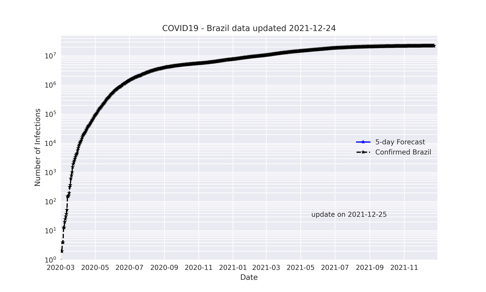
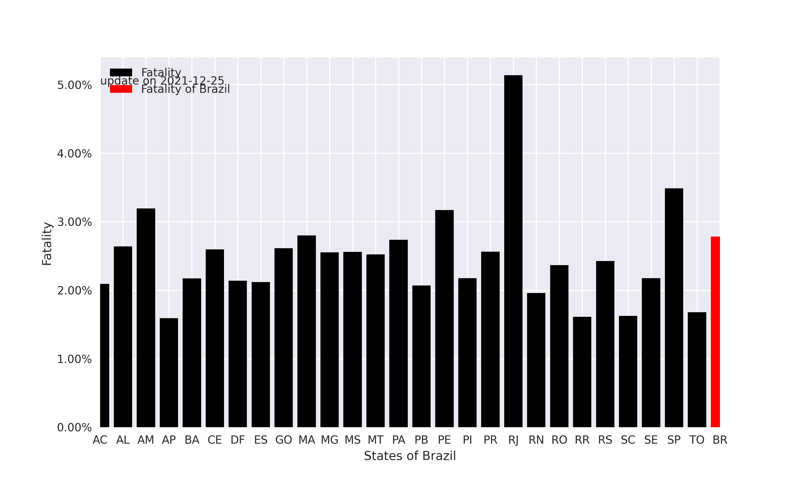
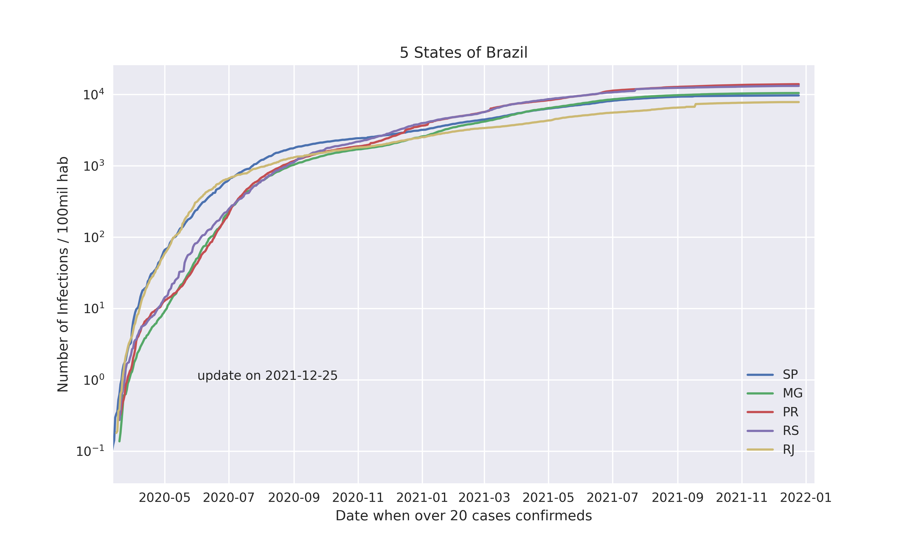
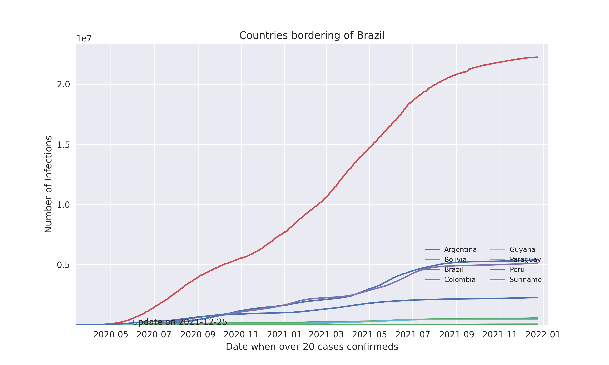

<!-- PROJECT SHIELDS -->
<!--
*** I'm using markdown "reference style" links for readability.
*** Reference links are enclosed in brackets [ ] instead of parentheses ( ).
*** See the bottom of this document for the declaration of the reference variables
*** for contributors-url, forks-url, etc. This is an optional, concise syntax you may use.
*** https://www.markdownguide.org/basic-syntax/#reference-style-links
-->

<!-- PROJECT LOGO -->
<br />
<p align="center">
  <a href="https://github.com/cmpaulo/corona">
    
  </a>

  <h3 align="center">Coronavirus (COVID-19) in Brazil</h3>

  <p align="center">
    An Analysis of the Spread of Coronavirus (COVID- 19) in Southeast Brazil<br/>
  using Prediction Model <br/> 
    <br/>
  <br/>
    · <a href="https://github.com/cmpaulo/corona"><strong>Explore the docs »</strong></a>
    · <a href="https://github.com/cmpaulo/corona">Report Bug</a>
    · <a href="https://cmpaulo.github.io/corona/"> GitPages - Site Corona </a>
    · <a href="https://github.com/cmpaulo/corona">Request a Feature</a>
  </p>
</p>

<!-- TABLE OF CONTENTS -->
## Table of Contents
*   [About the project](#about)
*   [Getting started](#started)
*   [Charts](#charts)
*   [References](#references)
*   [Contact](#contact)


About the project
-----------------

Observing the worldwide tendency to ignore some diseases that can become a pandemic, I have decided to give my contribution for understanding the COVID-19 pandemic in Southeast Brazil. This pandemic is demanding more knowledge of its behavior for the prediction and estimation of cases from tables of data collected from the global health agencies. These routines are still very primary, but we can already observe some behavior that we can predict or estimate with models of evolution of the infection (I) of healthy individuals (S) that can kill (D) these or let these (R, E) live.

SIR model is a simple mathematical model for epidemics. Epidemics happen when a disease spread very fast reaching a large number of people in a short period of time. It defines "S" for for the number of susceptible; "I" or the number of infectious, and "R" for the number of recovered or deceased/immune individuals. This model is also missing some elements, such as the creation of new susceptible people by being born, and the removal of susceptible, infected, and recovered people who die.

### Lockdown in Brazil
* * *

This video is in Brazilian Portuguese and presents some clarifications about the coronavirus.

<iframe width="560" height="315" src="https://www.youtube.com/embed/gs-HlvC5iJc" frameborder="0" allow="accelerometer; autoplay; encrypted-media; gyroscope; picture-in-picture" allowfullscreen></iframe>

Getting Started
---------------

This program has a database until March 24, 2020 for the number of confirmed cases for several countries. With the programs you can carry out an assessment of the lethality of COVID-19, and time/number evolution of infections.

### Prerequisites

The list of things that you need to use and how to install them.

* pip
```sh
pip install pandas numpy scipy wget
```

pip install pandas numpy scipy wget

### Installation


1. Get a free API Key at [https://github.com/cmpaulo/corona](https://github.com/cmpaulo/corona)
2. Clone the repo
```sh
git clone https://github.com/cmpaulo/corona.git
```


Charts
------


### Forecast of the number of infected for Brazil

This chart shows the number of infected people for Brazil.



* * *

### Infection prediction table

This table predicts the number of infected people for Brazil.

|   	|    Date    	| Prediction 	| Final number 	|
|:-:	|:----------:	|:----------:	|:------------:	|
<!--| 0 	| 2020-05-19 	|   255847   	|    254220    	|
| 1 	| 2020-05-20 	|   270500   	|       -      	|
| 2 	| 2020-05-21 	|   285876   	|       -      	|
| 3 	| 2020-05-22 	|   302011   	|       -      	|
| 4 	| 2020-05-23 	|   318943   	|       -      	|
| 5 	| 2020-05-24 	|   336711   	|       -      	|-->

* * *

### Fatality rate and infection rate by States in Brazil

This chart shows the fatality rate and infection rate by States in Brazil.



* * *

### Five States of Brazil with the bigger number of infections

This chart shows five States of Brazil with the bigger number of infections



* * *

### South America countries

This chart compares the cases of infections in South America countries


* * *

### Bordering countries of Brazil

This chart compares the cases of infections in bordering countries of Brazil



References
----------


*   [The SIR model.](https://idmod.org/docs/malaria/model-sir.html#sir-without-vital-dynamics)
*   [Observatório COVID-19 BR.](https://covid19br.github.io/index.html)
*   [Covid-19 Repository from the Centre for Mathematical Modelling of Infectious Diseases (CMMID), London School of Hygiene and Tropical Medicine.](https://cmmid.github.io/topics/covid19/)
*   [Jonh Hopkins Coronavirus Resource Center.](https://coronavirus.jhu.edu/map.html)
*   [Wesley Cota (UFV) website for monitoring confirmed cases in Brazil.](https://covid19br.wcota.me/)
*   [Python tool (SciPy).](https://docs.scipy.org/doc/scipy/reference/generated/scipy.optimize.curve_fit.html)

Contact
-------


This is a volunteer-driven project made by people from different areas and backgrounds. If you would like to know better about us, here are some links:

*   Claudio Paulo \[Creator and project leader\] [Linkedin](https://www.linkedin.com/in/claudio-machado-paulo-1866a2146), Twitter: [@cmp0484](https://twitter.com/cmp0484)
*   Frederico Gustavo \[Contributor\] [LinkedIn](www.linkedin.com/in/fredericogustavo)
*   Aracele Torres \[Contibutor\] [LinkedIn](https://www.linkedin.com/in/aracele-lima-torres-b96353134), Twitter: [@araceletorres](https://twitter.com/araceletorres/), [Github](https://github.com/aracele/)
*   Pedro Venturott \[Contibutor\] [LinkedIn](https://www.linkedin.com/in/pedro-henrique-gomes-venturott-30a379120/)
*   Gustavo Reginato \[Contributor\] [LinkedIn](https://www.linkedin.com/in/gustavo-reginato/)